# Verslag: Signing & Encryption with EJBCA and Evolution

## Groep 4 - Jelle, Ilias, Sem, Mayk, Robbe, Jentse, Cedric

Evolution Installatie
We zijn begonnen met het installeren van Evolution als onze mailclient op Linux, bekend om zijn betrouwbaarheid en geschiktheid voor onze eisen. Voor deze taak hebben we nieuwe e-mailaccounts aangemaakt met de namen jentse.evolution@hotmail.com en jacksonmate356@hotmail.com.

Om Evolution te installeren, hebben we de volgende commando gebruikt:
```bash
sudo apt install evolution
```
```bash
evolution
```
Nu, open Evolution en voeg je e-mailaccount toe.

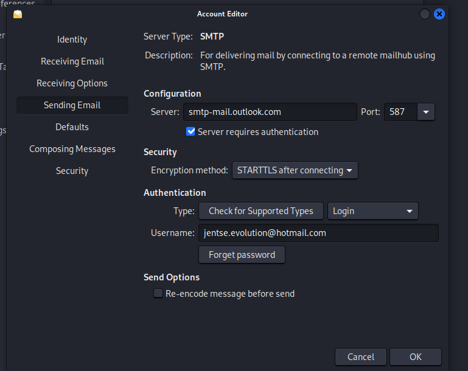
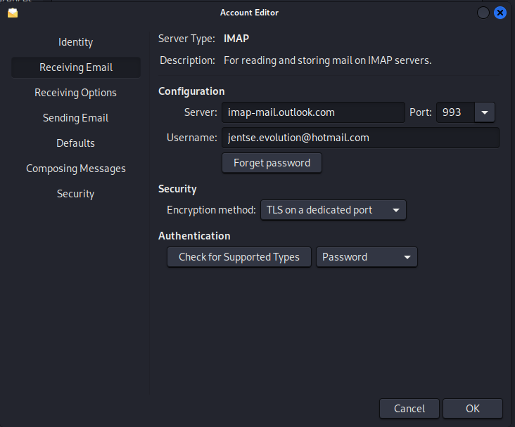
Nadat deze configuraties zijn ingesteld, zijn we gereed om IMAP en SMTP te gebruiken voor het veilig verzenden en ontvangen van e-mails.

## EJBCA-certificaten voor Ondertekening
Aanvankelijk werkten we aan het genereren van een certificaat, vergelijkbaar met de vorige taak waar de gebruiker een CSR uploadt en een certificaat van EJBCA ontvangt. Dit certificaat stelde ons in staat om e-mails te ondertekenen, maar er was een probleem met CN (Common Name) afwijking, zoals te zien is op de screenshot.
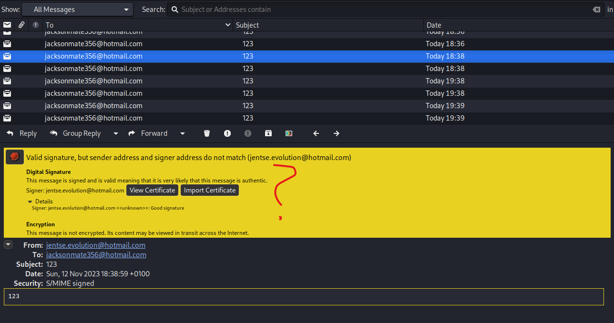


Om dit op te lossen, voegden we het e-mailattribuut toe aan ons Entity End-profiel, dat ontbrak en de afwijking tijdens het ondertekenen veroorzaakte. We hebben ook onze certificaatattributen aangepast om zowel ondertekening als versleuteling toe te staan. Standaard staan deze certificaten alleen ondertekening toe, maar nu staat Data-encryptie toe voor versleuteling.

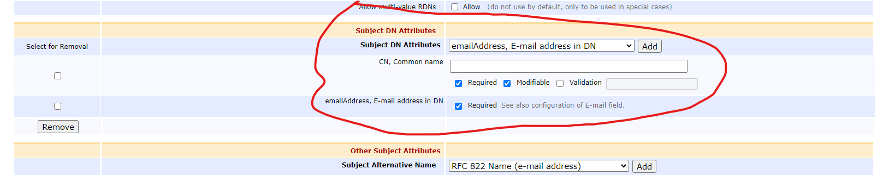

Met ons bijgewerkte End Entity-profiel en correct geconfigureerde certificaatattributen hebben we EJBCA verzocht om een certificaat te genereren voor ons e-mailaccount. Dit certificaattype komt overeen met degene die we hebben gemaakt, met de vereiste instellingen voor e-mailversleuteling en ondertekening. In plaats van handmatig een CSR te uploaden, hebben we eenvoudig een certificaat gegenereerd vanuit de CA met de CN als de naam van het e-mailaccount.
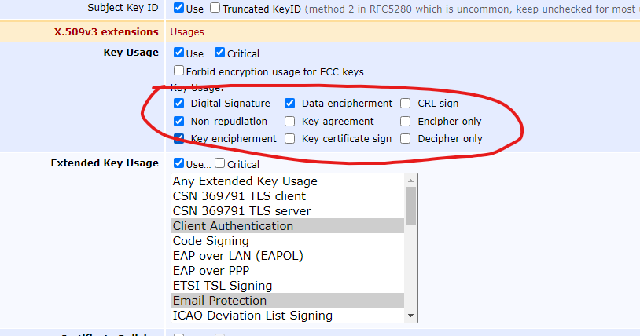


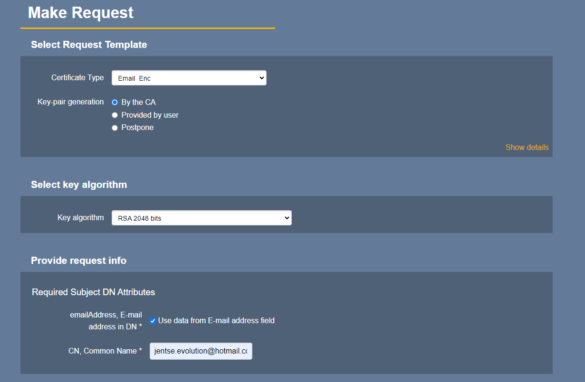
CN is in dit geval de naam van ons e-mailaccount: jentse.evolution@hotmail.com. We hebben ook het e-mailattribuut aangevinkt om deze te koppelen. Vervolgens hebben we gebruikersreferenties verstrekt om het certificaat te beveiligen. We merkten op dat Data-encryptie en Digitale Handtekening waren ingeschakeld in het Key Usage, waardoor we zowel e-mails konden ondertekenen als versleutelen.
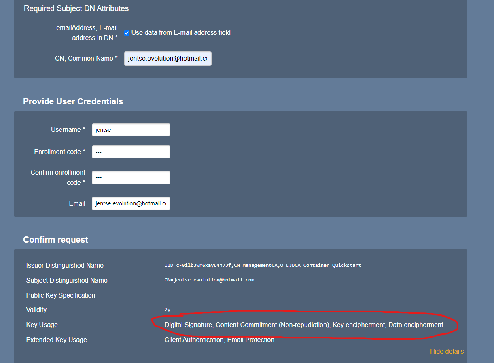


Vervolgens hebben we dit certificaat gedownload als PKCS#12, wat het standaardformaat is dat Evolution verwacht.
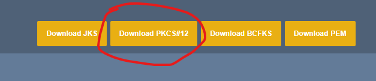

Daarna hebben we het certificaat geïmporteerd in Evolution. Het PKCS#12-bestand bevatte onze CN en e-mailattributen, samen met de uitgever van ons certificaat (EJBCA). We hebben ook de root-CA op onze Linux-machine geïmporteerd om vertrouwen te vestigen.
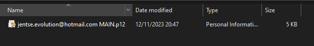
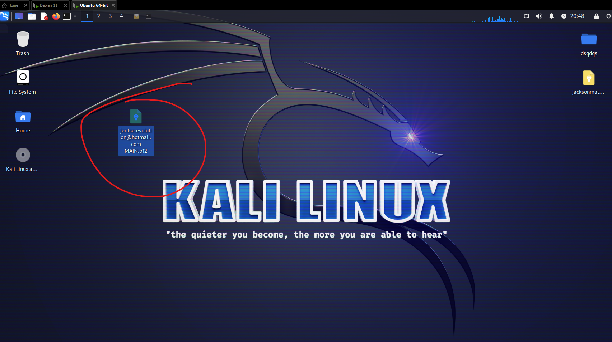

Certificaat voor het ondertekenen van jentse.evolution@hotmail.com
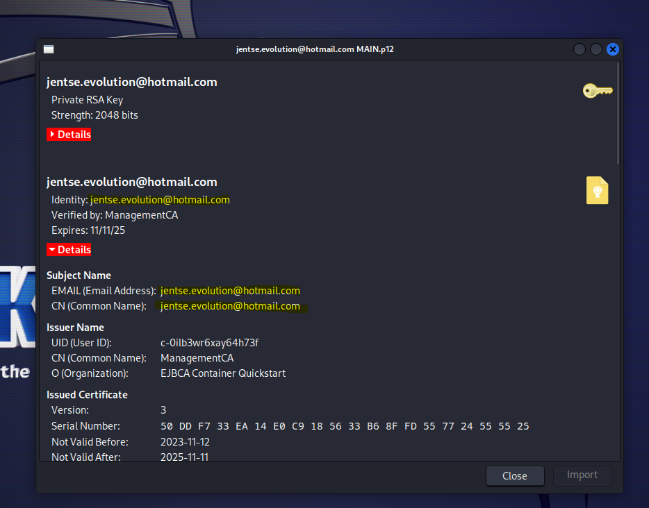

Certificaat voor het versleutelen van emails voor jacksonmate356@hotmail.com
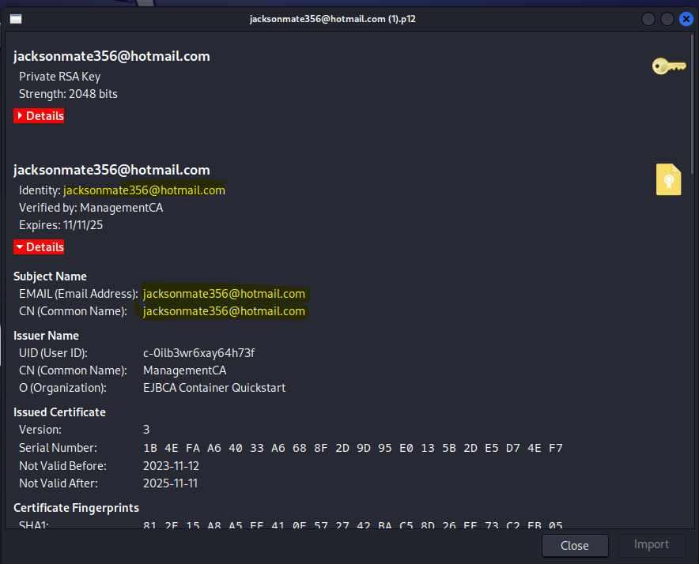


We hebben het certificaat geïmporteerd in Evolution om het te gebruiken voor ondertekening. Tijdens dit proces vroeg Evolution om het wachtwoord dat was ingesteld in EJBCA voor gebruikersreferenties.
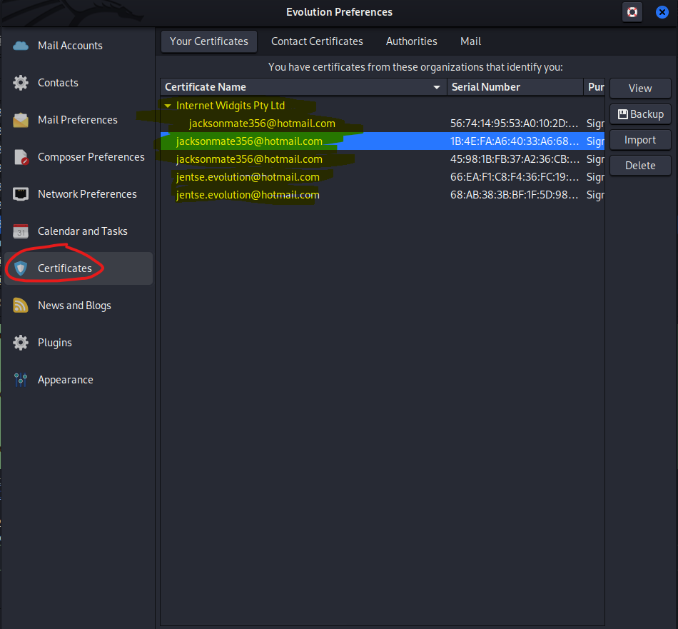
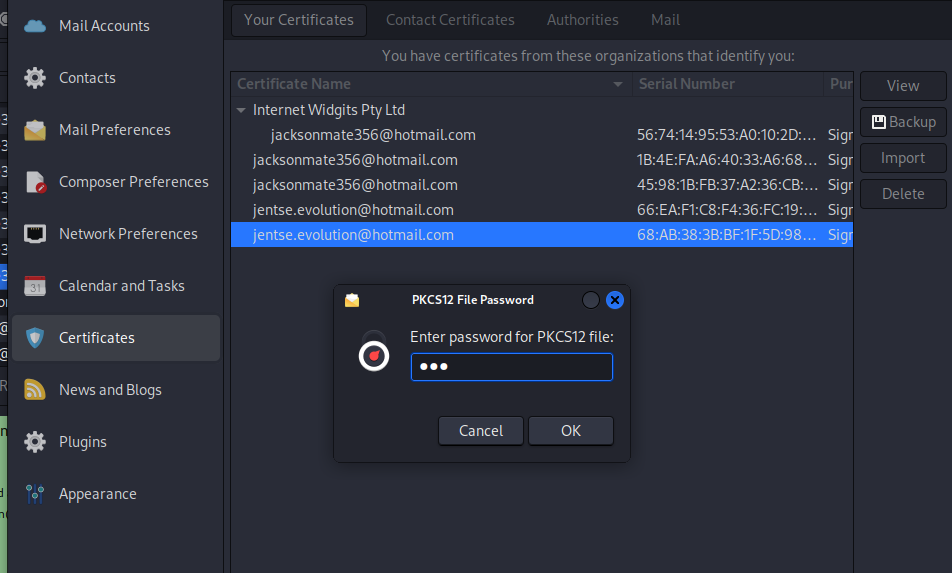

Nadat het certificaat was geïmporteerd, hebben we ons e-mailaccount geconfigureerd om het te gebruiken voor ondertekening. Dit deden we door naar Preferences > Emailaccount > Edit > Security te gaan.
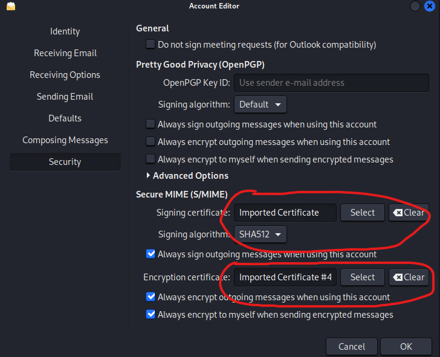

We hebben het geïmporteerde certificaat geselecteerd en aangegeven dat we voortaan onze e-mails willen ondertekenen.
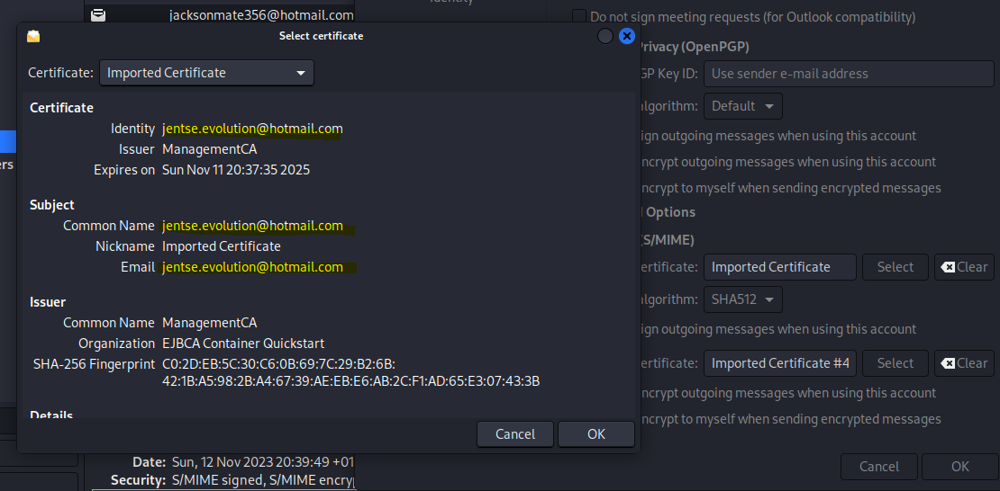

Als alles goed is verlopen, konden we nu een e-mail zien die was ondertekend met het EJBCA-certificaat voor jentse.evolution@hotmail.com.
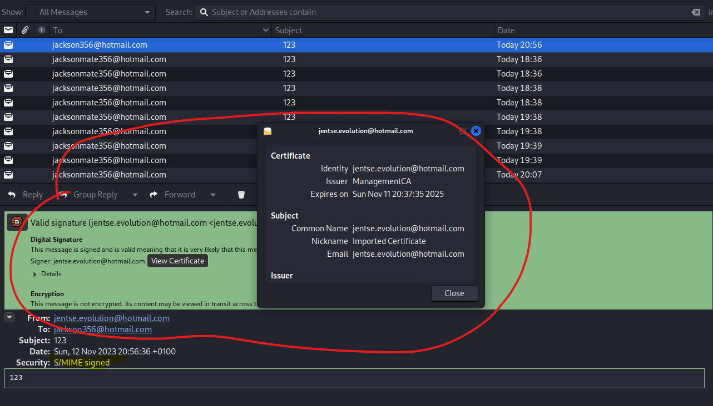

## Instellen van Versleuteling
Bij het aanmaken van een versleutelingscertificaat is het belangrijk om de CN van de ontvanger van de e-mail te gebruiken.

Voeg het versleutelingscertificaat toe aan Evolution. Selecteer het juiste certificaat.

Maak een e-mail en druk op de knop om de e-mail te ondertekenen en te versleutelen.
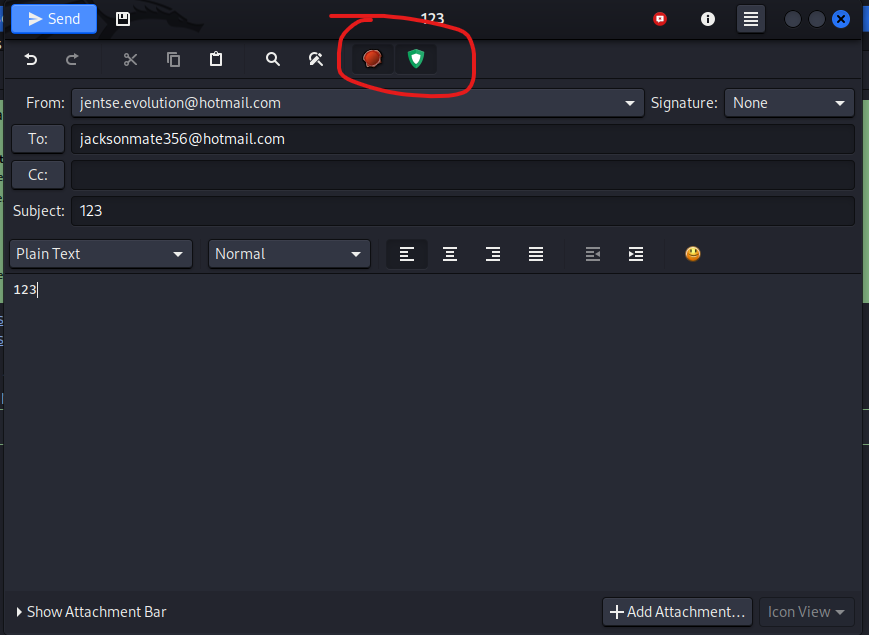

Dit is wat je krijgt als je alles correct hebt ingeteld.
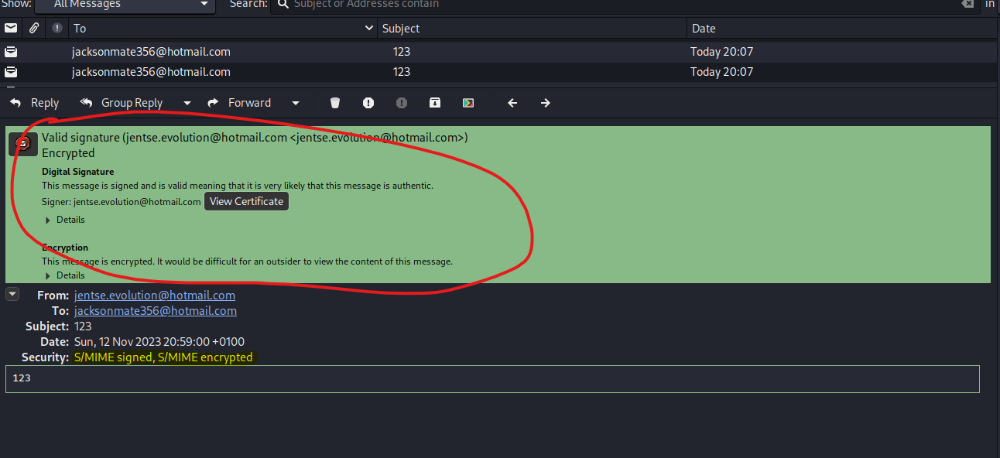
Ook geëncrypteerde e-mails kunnen worden gedecodeerd als we het certificaat importeren dat is gegenereerd door EJBCA voor het e-mailadres jacksonmate356@hotmail.com.

Threat Model:

