# Verslag: Signing & Encryption with EJBCA and Evolution

## Groep 4 - Jelle, Ilias, Sem, Mayk, Robbe, Jentse, Cedric

## Evolution Installatie
In eerste instantie zullen we Evolution gebruiken als mailclient op Linux. Deze staat bekend als betrouwbaar en voldoet goed aan onze eisen. 
Voor deze taak hebben we een nieuwe e-mailaccounts aangemaakt met de namen jentse.evolution@hotmail.com en jacksonmate356@hotmail.com. 
Vervolgens installeren we Evolution met de volgende commando: 

Om Evolution te installeren, hebben we de volgende commando gebruikt:
```bash
sudo apt install evolution
```
```bash
evolution
```
Open nu Evolution en voeg jouw mailaccount toe.

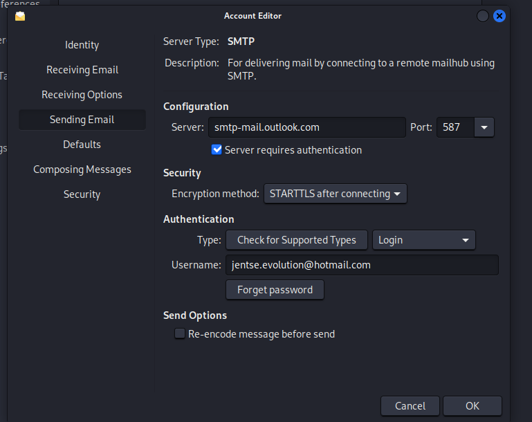
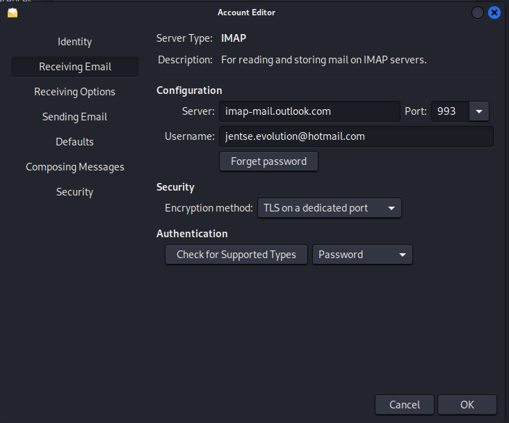

Zorg ervoor dat jouw IMAP en SMTP instellingen correct zijn (afhankelijk van jouw mail-provider). 

Nadat deze configuraties zijn ingesteld, zijn we gereed om IMAP en SMTP te gebruiken voor het veilig verzenden en ontvangen van e-mails.

## EJBCA-certificaten voor Ondertekening
In het begin hebben we gewerkt met het genereren van een certificaat, zoals in de vorige opdracht waar de gebruiker zelf een CSR uploadt en vervolgens een certificaat van EJBCA ontvangt. Hiermee konden we ondertekenen, maar het werkte niet volledig. Er was een mismatch tussen de CN en de verzender van de e-mail, zoals dit te zien is in de onderstaande screenshot: 
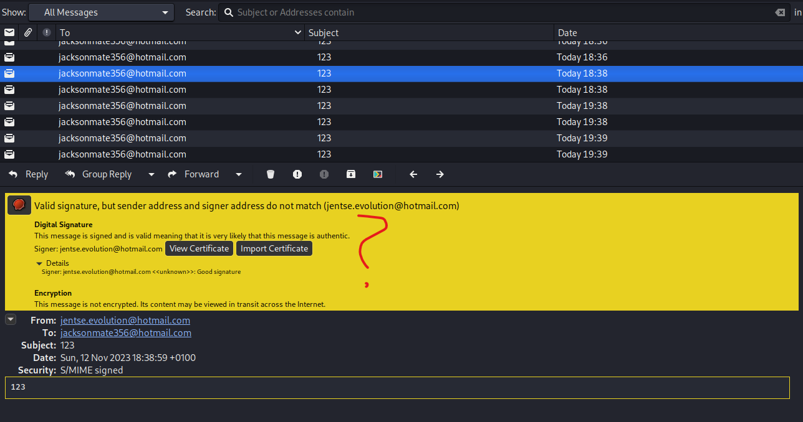


Om dit op te lossen, voegden we het e-mailattribuut toe aan ons Entity End-profiel. We hebben ook onze key usage aangepast om zowel ondertekening als versleuteling toe te staan. Standaard staan deze certificaten alleen ondertekening toe, maar nu staat Data-encryptie toe voor versleuteling.
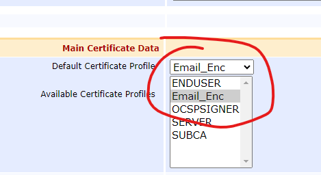
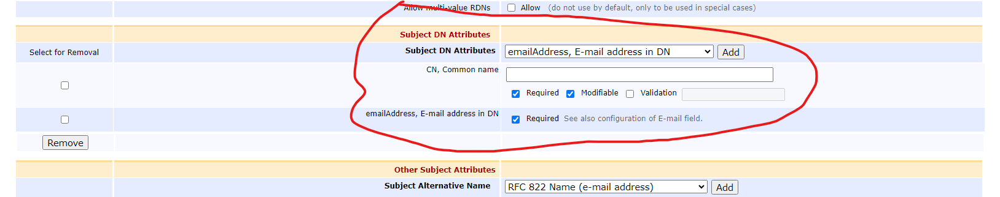

Met ons bijgewerkte End Entity-profiel en correct geconfigureerde certificaatattributen hebben we EJBCA verzocht om een certificaat te genereren voor ons e-mailaccount. Dit certificaattype komt overeen met degene die we hebben gemaakt, met de vereiste instellingen voor e-mailversleuteling en ondertekening. In plaats van handmatig een CSR te uploaden, hebben we eenvoudig een certificaat gegenereerd vanuit de CA met de CN als de naam van het e-mailaccount.
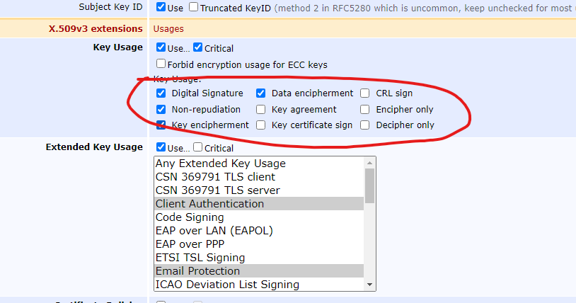


CN is in dit geval de naam van ons e-mailaccount: jentse.evolution@hotmail.com. We hebben ook het e-mailattribuut aangevinkt om deze te koppelen. Vervolgens hebben we gebruikersreferenties verstrekt om het certificaat te beveiligen. We merkten op dat Data-encryptie en Digitale Handtekening waren ingeschakeld in het Key Usage, waardoor we zowel e-mails konden ondertekenen als versleutelen.
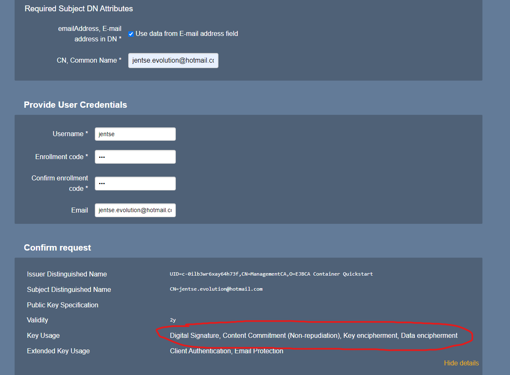


Vervolgens hebben we dit certificaat gedownload als PKCS#12, wat het standaardformaat is dat Evolution verwacht.


Daarna hebben we het certificaat geïmporteerd in Evolution. Het PKCS#12-bestand bevatte onze CN en e-mailattributen, samen met de uitgever van ons certificaat (EJBCA). We hebben ook de root-CA op onze Linux-machine geïmporteerd om vertrouwen te vestigen.
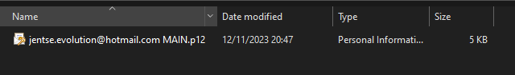
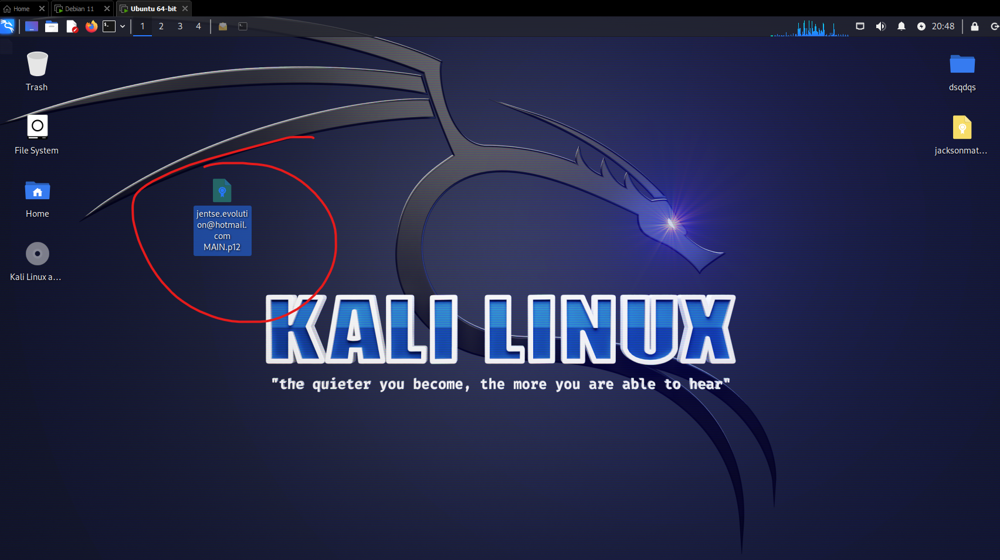

Certificaat voor het ondertekenen van jentse.evolution@hotmail.com
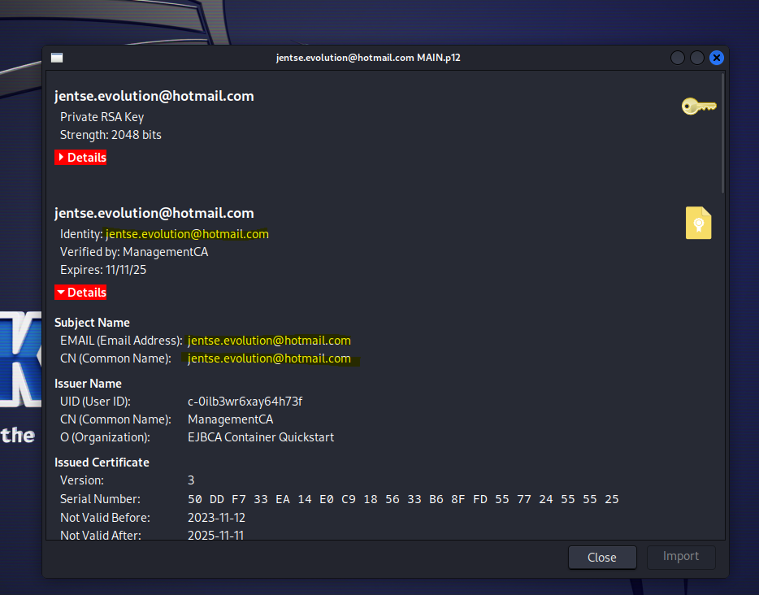

Certificaat voor het versleutelen van emails voor jacksonmate356@hotmail.com
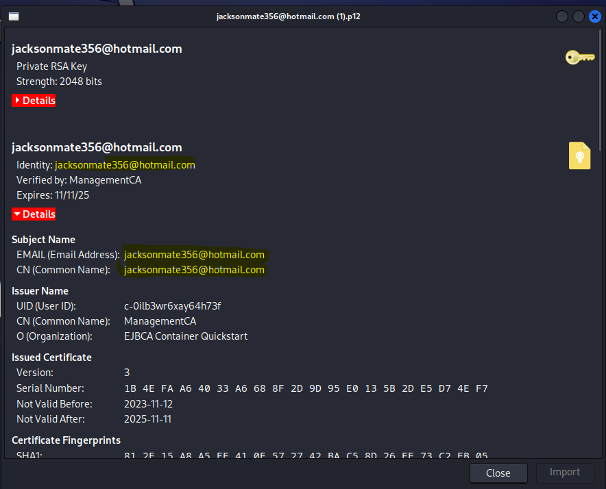


We hebben het certificaat geïmporteerd in Evolution om het te gebruiken voor ondertekening. Tijdens dit proces vroeg Evolution om het wachtwoord dat was ingesteld in EJBCA voor gebruikersreferenties.
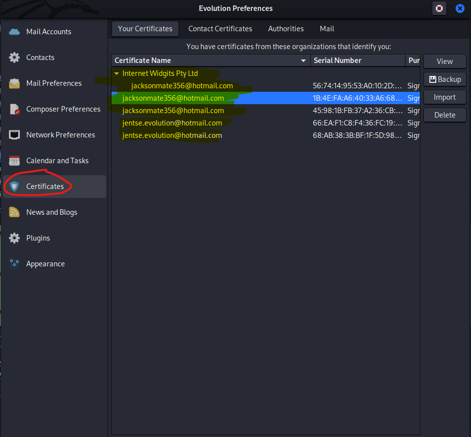
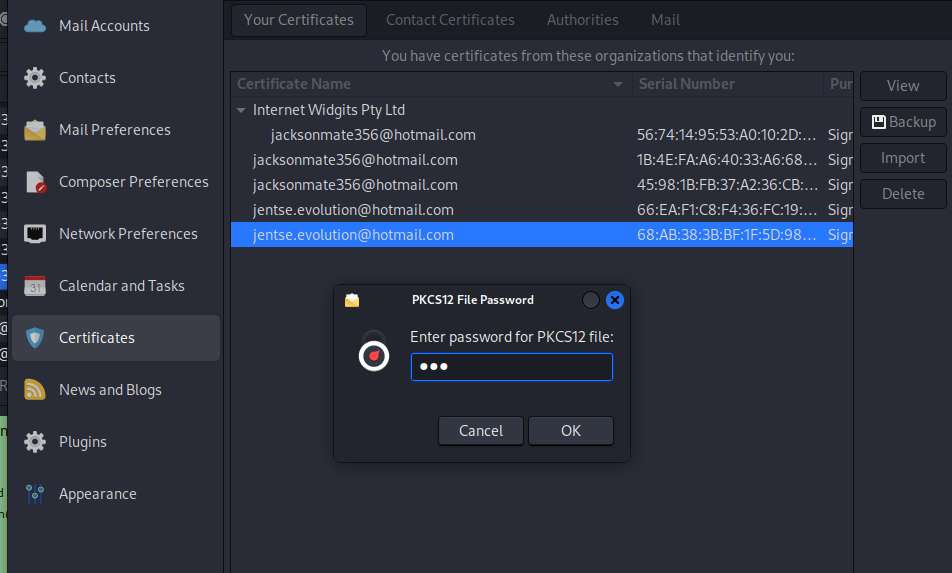

Nadat het certificaat was geïmporteerd, hebben we ons e-mailaccount geconfigureerd om het te gebruiken voor ondertekening. Dit deden we door naar Preferences > Emailaccount > Edit > Security te gaan.
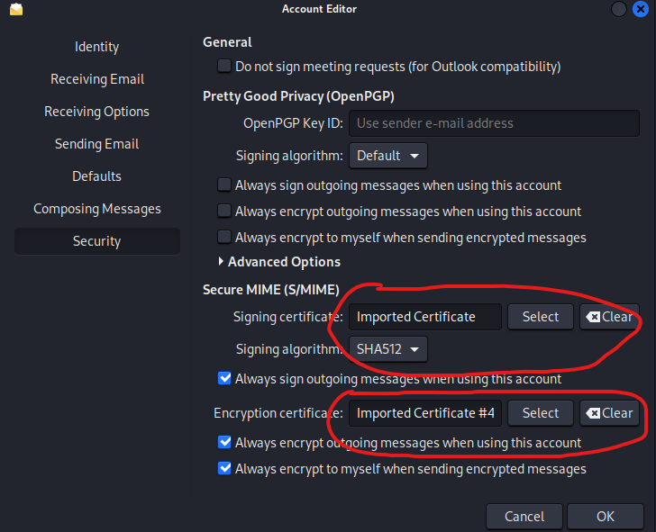

We hebben het geïmporteerde certificaat geselecteerd en aangegeven dat we voortaan onze e-mails willen ondertekenen.
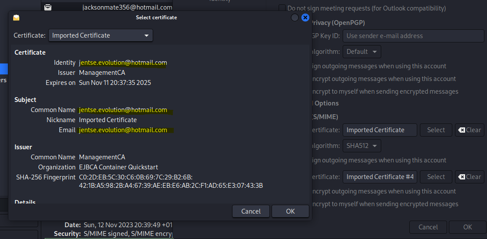

Als alles goed is verlopen, konden we nu een e-mail zien die was ondertekend met het EJBCA-certificaat voor jentse.evolution@hotmail.com.
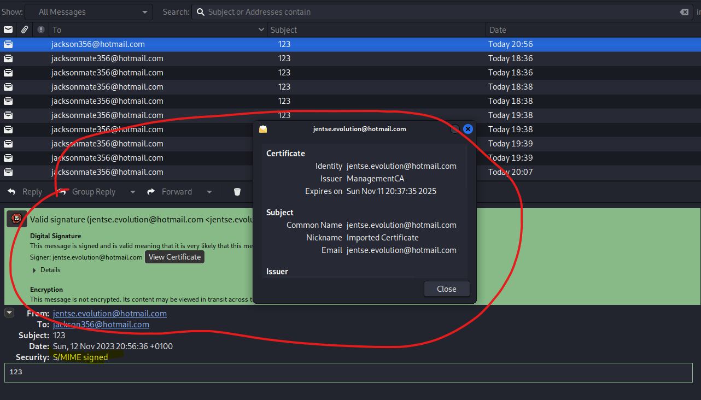

## Instellen van Versleuteling
Bij het aanmaken van een versleutelingscertificaat is het belangrijk om de CN van de ontvanger van de e-mail te gebruiken.


Voeg het versleutelingscertificaat toe aan Evolution. Selecteer het juiste certificaat. Hetzelfde zoals hiervoor maar hier selecteren we voor encrypteren het certificaat van jacksonmate356@hotmail.com

Maak een e-mail en druk op de knop om de e-mail te ondertekenen en te versleutelen.


Dit is wat je krijgt als je alles correct hebt ingeteld.
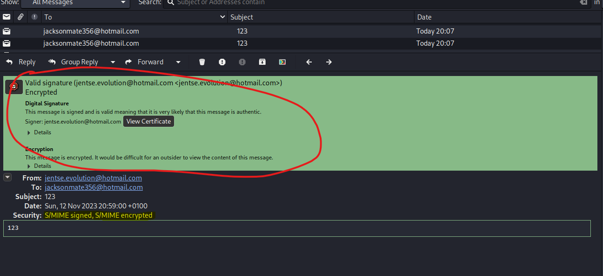
Ook geëncrypteerde e-mails kunnen worden gedecodeerd als we het certificaat importeren dat is gegenereerd door EJBCA voor het e-mailadres jacksonmate356@hotmail.com.
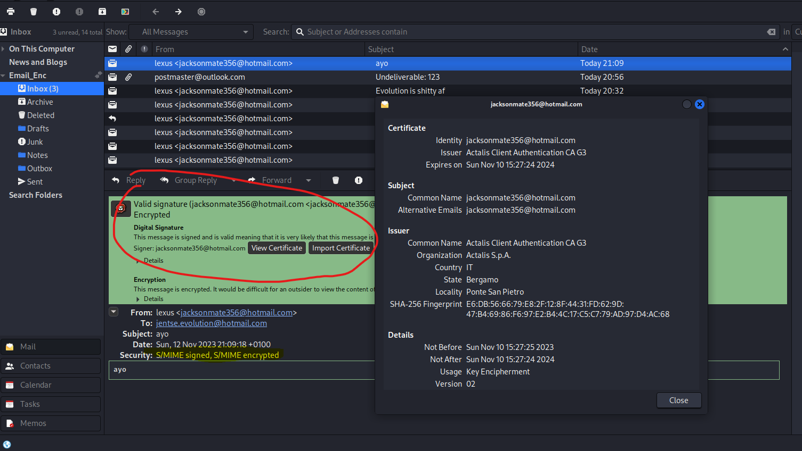
Threat Model:
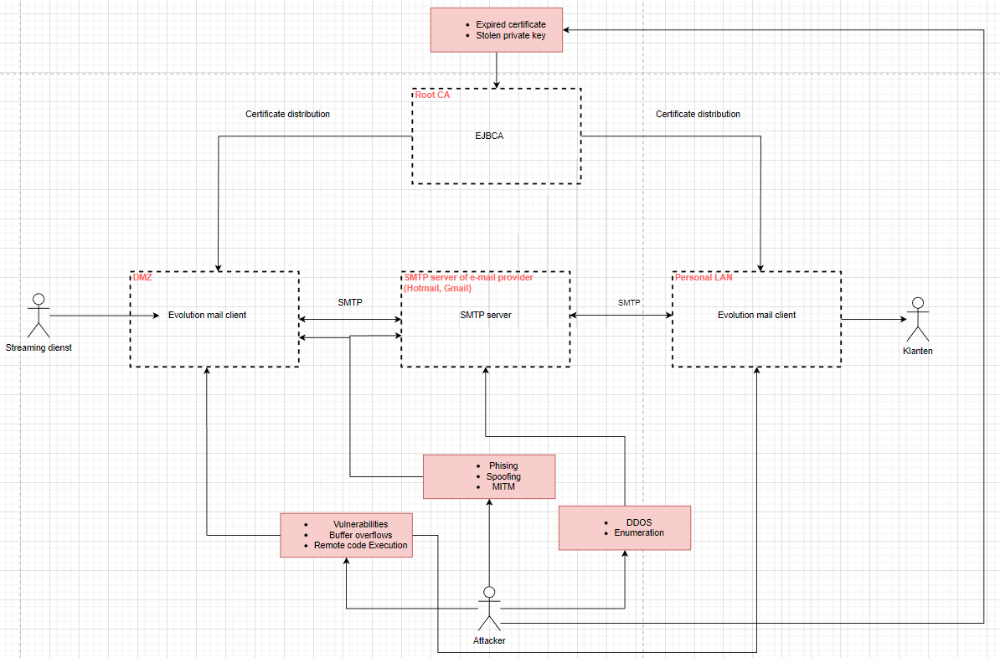
