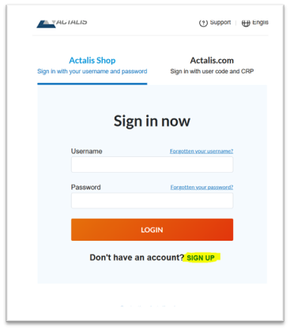
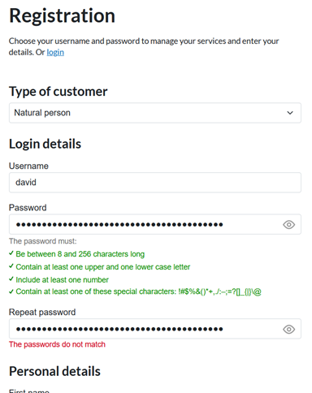
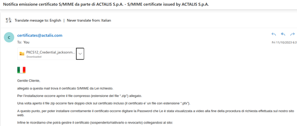
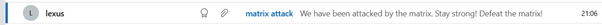

# Verslag: Implementatie S/MIME

### Inleiding:
We zullen onze certificaten aanvragen bij Actalis, aangezien het een van de weinige CAs is die een gratis S/MIME-certificaat aanbiedt. Het heeft ook als voordeel dat de ontvangers van onze email geen root CA moeten downloaden op hun machine.

### 1. Account aanmaken
1. Ga op actalis.com en maak een account aan.  

2. Vul jouw gegevens in.
   

3. Bij de laatste stap krijg je het wachtwoord van je certificaat te zien. Bewaar dit goed, aangezien dit de laatste keer is dat je het wachtwoord zult zien.

### 2. Certificaat
1. In je mailbox zou je normaal gesproken een certificaat als bijlage moeten hebben ontvangen.

2. Download het certificaat, zodat we het later kunnen importeren in onze Evolution-mailclient. We zullen dat certificaat gebruiken om e-mails te ondertekenen.

### 3. Certificaat importeren in Evolution
1. Open Evolution
2. Ga naar edit --> preferences
 een medaille te zien bij jouw e-mail. Dit betekent dat de e-mail is ondertekend en dat je er zeker van kunt zijn dat de ontvanger is wie hij zegt te zijn.

